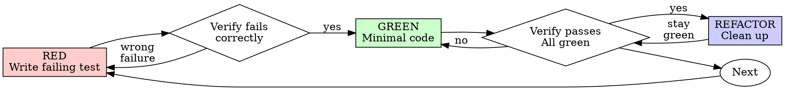

# Gangsta Software Development Skills — Implementation Plan

> **For agentic workers:** REQUIRED SUB-SKILL: Use gangsta's subagent-driven approach (recommended) or inline execution to implement this plan task-by-task. Steps use checkbox (`- [ ]`) syntax for tracking.

**Goal:** Add 7 software development skills and 1 new agent to the Gangsta framework, fully integrated with the existing Heist pipeline.

**Architecture:** Each skill is a standalone SKILL.md file in its own directory under `skills/`. The agent is a `.md` file in `agents/`. The audit-review skill also has a supporting prompt template. All cross-references use the `gangsta:` namespace. Existing skills are updated to reference new skills where relevant.

**Tech Stack:** Markdown with YAML frontmatter (agentskills.io spec). No code, no dependencies.

**Spec:** `docs/gangsta/specs/2026-04-13-dev-skills-design.md`

---

## File Structure

### New Files (9)

| File | Responsibility |
|------|---------------|
| `skills/interrogation-debugging/SKILL.md` | 4-phase root-cause debugging skill |
| `skills/drill-tdd/SKILL.md` | Red-Green-Refactor TDD enforcement skill |
| `skills/safehouse-worktrees/SKILL.md` | Isolated git worktree management skill |
| `skills/audit-review/SKILL.md` | Code review dispatch skill |
| `skills/audit-review/the-inspector-prompt.md` | Template for the-inspector agent |
| `skills/receiving-orders/SKILL.md` | Code review feedback processing skill |
| `skills/sweep-verification/SKILL.md` | Evidence-before-assertions completion gate skill |
| `skills/exit-strategy/SKILL.md` | Branch integration and worktree cleanup skill |
| `agents/the-inspector.md` | Code review agent definition |

### Modified Files (5)

| File | Change |
|------|--------|
| `skills/the-don/SKILL.md` | Add 7 skills to routing table + new intent row |
| `skills/the-hit/SKILL.md` | Cross-reference drill-tdd in TDD section |
| `skills/laundering/SKILL.md` | Cross-reference sweep-verification and audit-review |
| `skills/the-consigliere/SKILL.md` | Cross-reference interrogation-debugging |
| `README.md` | Add Software Development Skills section |

---

### Task 1: Create interrogation-debugging skill

**Files:**
- Create: `skills/interrogation-debugging/SKILL.md`

- [ ] **Step 1: Create the skill directory and file**

Create `skills/interrogation-debugging/SKILL.md` with the following content:

```markdown
---
name: interrogation-debugging
description: Use when encountering any bug, test failure, or unexpected behavior — finds the rat in the code through systematic root-cause interrogation before any fix attempts
---

# The Interrogation: Systematic Debugging

## Overview

Random fixes waste time and create new bugs. Quick patches let the real rat walk free.

**Core principle:** ALWAYS find the root cause before attempting fixes. Symptom fixes are stronzate.

**Violating the letter of this process is violating the spirit of debugging.**

## The Iron Law

```
NO FIXES WITHOUT ROOT CAUSE INVESTIGATION FIRST
```

If you haven't completed Phase 1, you cannot propose fixes. This is Omerta.

## When to Use

Use for ANY technical issue:
- Test failures
- Bugs in production
- Unexpected behavior
- Performance problems
- Build failures
- Integration issues

**Use this ESPECIALLY when:**
- Under time pressure (emergencies make guessing tempting)
- "Just one quick fix" seems obvious
- You've already tried multiple fixes
- Previous fix didn't work
- You don't fully understand the issue

**Don't skip when:**
- Issue seems simple (simple bugs have root causes too)
- You're in a hurry (rushing guarantees rework)
- The Don wants it fixed NOW (systematic is faster than thrashing)

## The Four Phases

You MUST complete each phase before proceeding to the next.

### Phase 1: Crime Scene Investigation

**BEFORE attempting ANY fix:**

1. **Read the Evidence**
   - Don't skip past errors or warnings
   - They often contain the exact solution
   - Read stack traces completely
   - Note line numbers, file paths, error codes

2. **Reproduce the Crime**
   - Can you trigger it reliably?
   - What are the exact steps?
   - Does it happen every time?
   - If not reproducible → gather more data, don't guess

3. **Check Recent Activity**
   - What changed that could cause this?
   - Git diff, recent commits
   - New dependencies, config changes
   - Environmental differences

4. **Gather Evidence at Every Boundary**

   **WHEN system has multiple components (CI → build → signing, API → service → database):**

   **BEFORE proposing fixes, add diagnostic instrumentation:**

   For EACH component boundary:
   - Log what data enters the component
   - Log what data exits the component
   - Verify environment/config propagation
   - Check state at each layer

   Run once to gather evidence showing WHERE it breaks.
   THEN analyze evidence to identify the failing component.
   THEN investigate that specific component.

5. **Trace the Data Flow**

   **WHEN error is deep in the call stack:**

   - Where does the bad value originate?
   - What called this with the bad value?
   - Keep tracing backward until you find the source
   - Fix at source, not at symptom

### Phase 2: Cross-Examination

**Find the pattern before fixing:**

1. **Find Working Examples**
   - Locate similar working code in the same codebase
   - What works that's similar to what's broken?

2. **Compare Against References**
   - If implementing a pattern, read the reference implementation COMPLETELY
   - Don't skim — read every line
   - Understand the pattern fully before applying

3. **Identify Differences**
   - What's different between working and broken?
   - List every difference, however small
   - Don't assume "that can't matter"

4. **Understand Dependencies**
   - What other components does this need?
   - What settings, config, environment?
   - What assumptions does it make?

### Phase 3: The Theory

**Scientific method:**

1. **Form Single Hypothesis**
   - State clearly: "I think X is the root cause because Y"
   - Write it down
   - Be specific, not vague

2. **Test Minimally**
   - Make the SMALLEST possible change to test the hypothesis
   - One variable at a time
   - Don't fix multiple things at once

3. **Verify Before Continuing**
   - Did it work? Yes → Phase 4
   - Didn't work? Form NEW hypothesis
   - DON'T add more fixes on top

4. **When You Don't Know**
   - Say "I don't understand X"
   - Don't pretend to know
   - Ask for help or research more

### Phase 4: The Hit

**Fix the root cause, not the symptom:**

1. **Create Failing Test Case**
   - Simplest possible reproduction
   - Automated test if possible
   - One-off test script if no framework
   - MUST have before fixing
   - Use `gangsta:drill-tdd` for writing proper failing tests

2. **Implement Single Fix**
   - Address the root cause identified
   - ONE change at a time
   - No "while I'm here" improvements
   - No bundled refactoring

3. **Verify Fix**
   - Test passes now?
   - No other tests broken?
   - Issue actually resolved?
   - Use `gangsta:sweep-verification` to verify before claiming success

4. **If Fix Doesn't Work**
   - STOP
   - Count: How many fixes have you tried?
   - If < 3: Return to Phase 1, re-analyze with new information
   - **If ≥ 3: STOP and escalate (Step 5 below)**
   - DON'T attempt Fix #4 without architectural discussion

5. **If 3+ Fixes Failed: Escalate to the Don**

   **Pattern indicating architectural rot:**
   - Each fix reveals new shared state/coupling/problem in a different place
   - Fixes require "massive refactoring" to implement
   - Each fix creates new symptoms elsewhere

   **STOP and question fundamentals:**
   - Is this pattern fundamentally sound?
   - Are we sticking with it through sheer inertia?
   - Should we refactor architecture vs. continue fixing symptoms?

   **Discuss with the Don before attempting more fixes.**

   This is NOT a failed hypothesis — this is a wrong architecture.

## Red Flags — STOP and Follow Process

If you catch yourself thinking:

| Thought | Reality |
|---------|---------|
| "Quick fix for now, investigate later" | Investigate NOW. Quick fixes compound. |
| "Just try changing X and see" | That's guessing, not debugging. Phase 1. |
| "Add multiple changes, run tests" | Can't isolate what worked. One at a time. |
| "Skip the test, I'll manually verify" | Manual verification is not evidence. |
| "It's probably X, let me fix that" | "Probably" means you haven't investigated. |
| "I don't fully understand but this might work" | Might = guessing. Phase 1. |
| "One more fix attempt" (after 2+) | 3 failures = architectural problem. Escalate. |
| "Here are the main problems: [list]" | Listing without investigating = stronzate. |
| Proposing solutions before tracing data flow | STOP. Trace first, propose second. |

**ALL of these mean: STOP. Return to Phase 1.**

## The Don's Signals You're Doing It Wrong

Watch for these redirections:
- "Is that not happening?" — You assumed without verifying
- "Will it show us...?" — You should have added evidence gathering
- "Stop guessing" — You're proposing fixes without understanding
- "Think harder" — Question fundamentals, not just symptoms
- "We're stuck?" (frustrated) — Your approach isn't working

**When you see these:** STOP. Return to Phase 1.

## Common Rationalizations

| Excuse | Reality |
|--------|---------|
| "Issue is simple, don't need process" | Simple issues have root causes too. Process is fast for simple bugs. |
| "Emergency, no time for process" | Systematic debugging is FASTER than guess-and-check thrashing. |
| "Just try this first, then investigate" | First fix sets the pattern. Do it right from the start. |
| "I'll write test after confirming fix works" | Untested fixes don't stick. Test first proves it. |
| "Multiple fixes at once saves time" | Can't isolate what worked. Causes new bugs. |
| "Reference too long, I'll adapt the pattern" | Partial understanding guarantees bugs. Read it completely. |
| "I see the problem, let me fix it" | Seeing symptoms ≠ understanding root cause. |
| "One more fix attempt" (after 2+ failures) | 3+ failures = architectural problem. Escalate to the Don. |

## Quick Reference

| Phase | Key Activities | Success Criteria |
|-------|---------------|------------------|
| **1. Crime Scene** | Read errors, reproduce, check changes, gather evidence | Understand WHAT and WHY |
| **2. Cross-Examination** | Find working examples, compare | Identify differences |
| **3. The Theory** | Form hypothesis, test minimally | Confirmed or new hypothesis |
| **4. The Hit** | Create test, fix, verify | Bug resolved, tests pass |

## When Investigation Reveals No Root Cause

If systematic investigation reveals the issue is truly environmental, timing-dependent, or external:

1. You've completed the process
2. Document what you investigated
3. Implement appropriate handling (retry, timeout, error message)
4. Add monitoring/logging for future investigation

**But:** 95% of "no root cause" cases are incomplete investigation.

## Related Skills

- **gangsta:drill-tdd** — For creating failing test case (Phase 4, Step 1)
- **gangsta:sweep-verification** — Verify fix worked before claiming success

## Omerta Compliance
- [ ] Rule of Truth: All findings cite specific code, error output, or evidence
- [ ] Spec is Law: Fixes trace to diagnosed root cause, not guesswork
```

- [ ] **Step 2: Verify frontmatter is valid**

Run: `head -4 skills/interrogation-debugging/SKILL.md`
Expected: Lines starting with `---`, `name: interrogation-debugging`, `description: Use when...`, `---`

- [ ] **Step 3: Commit**

```bash
git add skills/interrogation-debugging/SKILL.md
git commit -m "Add interrogation-debugging skill — systematic root-cause debugging"
```

---

### Task 2: Create drill-tdd skill

**Files:**
- Create: `skills/drill-tdd/SKILL.md`

- [ ] **Step 1: Create the skill directory and file**

Create `skills/drill-tdd/SKILL.md` with the following content:

```markdown
---
name: drill-tdd
description: Use when implementing any feature or bugfix — enforces the Red-Green-Refactor drill with no production code allowed without a failing test first
---

# The Drill: Test-Driven Development

## Overview

Write the test first. Watch it fail. Write minimal code to pass.

**Core principle:** If you didn't watch the test fail, you don't know if it tests the right thing.

**Violating the letter of the rules is violating the spirit of the rules.**

## When to Use

**Always:**
- New features
- Bug fixes
- Refactoring
- Behavior changes

**Exceptions (ask the Don):**
- Throwaway prototypes
- Generated code
- Configuration files

Thinking "skip the Drill just this once"? Stop. That's rationalization.

## The Iron Law (The Omerta of Testing)

```
NO PRODUCTION CODE WITHOUT A FAILING TEST FIRST
```

Write code before the test? Delete it. Start over.

**No exceptions:**
- Don't keep it as "reference"
- Don't "adapt" it while writing tests
- Don't look at it
- Delete means delete

Implement fresh from tests. Period.

## Red-Green-Refactor



### RED — Write Failing Test

Write one minimal test showing what should happen.

<Good>
```typescript
test('retries failed operations 3 times', async () => {
  let attempts = 0;
  const operation = () => {
    attempts++;
    if (attempts < 3) throw new Error('fail');
    return 'success';
  };

  const result = await retryOperation(operation);

  expect(result).toBe('success');
  expect(attempts).toBe(3);
});
```
Clear name, tests real behavior, one thing
</Good>

<Bad>
```typescript
test('retry works', async () => {
  const mock = jest.fn()
    .mockRejectedValueOnce(new Error())
    .mockRejectedValueOnce(new Error())
    .mockResolvedValueOnce('success');
  await retryOperation(mock);
  expect(mock).toHaveBeenCalledTimes(3);
});
```
Vague name, tests mock not code
</Bad>

**Requirements:**
- One behavior per test
- Clear descriptive name
- Real code (no mocks unless unavoidable)

### Verify RED — Watch It Fail

**MANDATORY. Never skip.**

Run the test. Confirm:
- Test fails (not errors)
- Failure message is expected
- Fails because feature missing (not typos)

**Test passes?** You're testing existing behavior. Fix the test.

**Test errors?** Fix the error, re-run until it fails correctly.

### GREEN — Minimal Code

Write the simplest code to pass the test.

<Good>
```typescript
async function retryOperation<T>(fn: () => Promise<T>): Promise<T> {
  for (let i = 0; i < 3; i++) {
    try {
      return await fn();
    } catch (e) {
      if (i === 2) throw e;
    }
  }
  throw new Error('unreachable');
}
```
Just enough to pass
</Good>

<Bad>
```typescript
async function retryOperation<T>(
  fn: () => Promise<T>,
  options?: {
    maxRetries?: number;
    backoff?: 'linear' | 'exponential';
    onRetry?: (attempt: number) => void;
  }
): Promise<T> {
  // YAGNI — over-engineered
}
```
Over-engineered
</Bad>

Don't add features, refactor other code, or "improve" beyond the test.

### Verify GREEN — Watch It Pass

**MANDATORY.**

Run the test. Confirm:
- Test passes
- Other tests still pass
- Output pristine (no errors, warnings)

**Test fails?** Fix code, not test.

**Other tests fail?** Fix now.

### REFACTOR — Clean Up

After green only:
- Remove duplication
- Improve names
- Extract helpers

Keep tests green. Don't add behavior.

### Repeat

Next failing test for next behavior.

## Good Tests

| Quality | Good | Bad |
|---------|------|-----|
| **Minimal** | One thing. "and" in name? Split it. | `test('validates email and domain and whitespace')` |
| **Clear** | Name describes behavior | `test('test1')` |
| **Shows intent** | Demonstrates desired API | Obscures what code should do |

## Why Order Matters

**"I'll write tests after to verify it works"**

Tests written after code pass immediately. Passing immediately proves nothing:
- Might test wrong thing
- Might test implementation, not behavior
- Might miss edge cases you forgot
- You never saw it catch the bug

Test-first forces you to see the test fail, proving it actually tests something.

**"Deleting X hours of work is wasteful"**

Sunk cost fallacy. The time is already gone. Your choice now:
- Delete and rewrite with TDD (high confidence)
- Keep it and add tests after (low confidence, likely bugs)

The "waste" is keeping code you can't trust.

**"TDD is dogmatic, being pragmatic means adapting"**

TDD IS pragmatic:
- Finds bugs before commit (faster than debugging after)
- Prevents regressions (tests catch breaks immediately)
- Documents behavior (tests show how to use code)
- Enables refactoring (change freely, tests catch breaks)

"Pragmatic" shortcuts = debugging in production = slower.

## Common Rationalizations

| Excuse | Reality |
|--------|---------|
| "Too simple to test" | Simple code breaks. Test takes 30 seconds. |
| "I'll test after" | Tests passing immediately prove nothing. |
| "Already manually tested" | Ad-hoc ≠ systematic. No record, can't re-run. |
| "Deleting X hours is wasteful" | Sunk cost fallacy. Keeping unverified code is debt. |
| "Keep as reference, write tests first" | You'll adapt it. That's testing after. Delete means delete. |
| "Need to explore first" | Fine. Throw away exploration, start with the Drill. |
| "Test hard = design unclear" | Listen to test. Hard to test = hard to use. |
| "TDD will slow me down" | The Drill is faster than debugging. |
| "Existing code has no tests" | You're improving it. Add tests for what you touch. |

## Red Flags — STOP and Start Over

- Code before test
- Test after implementation
- Test passes immediately
- Can't explain why test failed
- Tests added "later"
- Rationalizing "just this once"
- "Keep as reference" or "adapt existing code"
- "Already spent X hours, deleting is wasteful"
- "TDD is dogmatic, I'm being pragmatic"

**All of these mean: Delete code. Start over with the Drill.**

## Example: Bug Fix

**Bug:** Empty email accepted

**RED**
```typescript
test('rejects empty email', async () => {
  const result = await submitForm({ email: '' });
  expect(result.error).toBe('Email required');
});
```

**Verify RED**
```
$ npm test
FAIL: expected 'Email required', got undefined
```

**GREEN**
```typescript
function submitForm(data: FormData) {
  if (!data.email?.trim()) {
    return { error: 'Email required' };
  }
  // ...existing code
}
```

**Verify GREEN**
```
$ npm test
PASS
```

**REFACTOR** — Extract validation for multiple fields if needed.

## Verification Checklist

Before marking work complete:

- [ ] Every new function/method has a test
- [ ] Watched each test fail before implementing
- [ ] Each test failed for expected reason (feature missing, not typo)
- [ ] Wrote minimal code to pass each test
- [ ] All tests pass
- [ ] Output pristine (no errors, warnings)
- [ ] Tests use real code (mocks only if unavoidable)
- [ ] Edge cases and errors covered

Can't check all boxes? You skipped the Drill. Start over.

## Debugging Integration

Bug found? Write failing test reproducing it. Follow the Drill cycle. Test proves fix and prevents regression.

Never fix bugs without a test. Use `gangsta:interrogation-debugging` for root-cause investigation first.

## When Stuck

| Problem | Solution |
|---------|----------|
| Don't know how to test | Write wished-for API. Write assertion first. Ask the Don. |
| Test too complicated | Design too complicated. Simplify interface. |
| Must mock everything | Code too coupled. Use dependency injection. |
| Test setup huge | Extract helpers. Still complex? Simplify design. |

## Omerta Compliance
- [ ] Rule of Truth: Test output is actual command output, not claims
- [ ] Spec is Law: Every implementation traces to a test that traces to a requirement
```

- [ ] **Step 2: Verify frontmatter is valid**

Run: `head -4 skills/drill-tdd/SKILL.md`
Expected: Lines starting with `---`, `name: drill-tdd`, `description: Use when...`, `---`

- [ ] **Step 3: Commit**

```bash
git add skills/drill-tdd/SKILL.md
git commit -m "Add drill-tdd skill — TDD Red-Green-Refactor enforcement"
```

---

### Task 3: Create safehouse-worktrees skill

**Files:**
- Create: `skills/safehouse-worktrees/SKILL.md`

- [ ] **Step 1: Create the skill directory and file**

Create `skills/safehouse-worktrees/SKILL.md` with the following content:

```markdown
---
name: safehouse-worktrees
description: Use when starting feature work that needs isolation from the current workspace — sets up a secure safehouse with git worktrees for clean operational bases
---

# The Safehouse: Git Worktrees

## Overview

Git worktrees create isolated operational bases sharing the same repository. Work on multiple branches simultaneously without compromising the main workspace.

**Core principle:** Systematic directory selection + safety verification = reliable isolation.

**Announce at start:** "Setting up a safehouse for isolated operations."

## Directory Selection Process

Follow this priority order:

### 1. Check Existing Safehouses

```bash
# Check in priority order
ls -d .worktrees 2>/dev/null     # Preferred (hidden)
ls -d worktrees 2>/dev/null      # Alternative
```

**If found:** Use that directory. If both exist, `.worktrees/` wins.

### 2. Check Project Config

```bash
grep -i "worktree.*director" AGENTS.md 2>/dev/null
```

**If preference specified:** Use it without asking.

### 3. Ask the Don

If no directory exists and no config preference:

```
No safehouse directory found. Where should I set up?

1. .worktrees/ (project-local, hidden)
2. ~/.config/gangsta/worktrees/<project-name>/ (global location)

Which would you prefer?
```

## Safety Verification

### For Project-Local Directories (.worktrees or worktrees)

**MUST verify directory is gitignored before creating safehouse:**

```bash
# Check if directory is ignored (respects local, global, and system gitignore)
git check-ignore -q .worktrees 2>/dev/null || git check-ignore -q worktrees 2>/dev/null
```

**If NOT ignored:**
1. Add appropriate line to `.gitignore`
2. Commit the change immediately
3. Proceed with safehouse creation

**Why critical:** Prevents accidentally committing safehouse contents to repository.

### For Global Directory (~/.config/gangsta/worktrees)

No `.gitignore` verification needed — outside project entirely.

## Creation Steps

### 1. Detect Project Name

```bash
project=$(basename "$(git rev-parse --show-toplevel)")
```

### 2. Create Safehouse

```bash
# Determine full path
case $LOCATION in
  .worktrees|worktrees)
    path="$LOCATION/$BRANCH_NAME"
    ;;
  ~/.config/gangsta/worktrees/*)
    path="~/.config/gangsta/worktrees/$project/$BRANCH_NAME"
    ;;
esac

# Create worktree with new branch
git worktree add "$path" -b "$BRANCH_NAME"
cd "$path"
```

### 3. Run Project Setup

Auto-detect and run appropriate setup:

```bash
# Node.js
if [ -f package.json ]; then npm install; fi

# Rust
if [ -f Cargo.toml ]; then cargo build; fi

# Python
if [ -f requirements.txt ]; then pip install -r requirements.txt; fi
if [ -f pyproject.toml ]; then poetry install; fi

# Go
if [ -f go.mod ]; then go mod download; fi
```

### 4. Verify Clean Baseline

Run tests to ensure safehouse starts clean:

```bash
# Use project-appropriate command
npm test / cargo test / pytest / go test ./...
```

**If tests fail:** Report failures, ask the Don whether to proceed or investigate.

**If tests pass:** Report ready.

### 5. Report Location

```
Safehouse ready at <full-path>
Tests passing (<N> tests, 0 failures)
Ready for operations.
```

## Quick Reference

| Situation | Action |
|-----------|--------|
| `.worktrees/` exists | Use it (verify ignored) |
| `worktrees/` exists | Use it (verify ignored) |
| Both exist | Use `.worktrees/` |
| Neither exists | Check AGENTS.md → Ask the Don |
| Directory not ignored | Add to .gitignore + commit |
| Tests fail during baseline | Report failures + ask the Don |
| No package.json/Cargo.toml | Skip dependency install |

## Common Mistakes

### Skipping ignore verification
- **Problem:** Safehouse contents get tracked, pollute git status
- **Fix:** Always use `git check-ignore` before creating project-local safehouse

### Assuming directory location
- **Problem:** Creates inconsistency, violates project conventions
- **Fix:** Follow priority: existing > config > ask

### Proceeding with failing tests
- **Problem:** Can't distinguish new bugs from pre-existing issues
- **Fix:** Report failures, get explicit permission from the Don

### Hardcoding setup commands
- **Problem:** Breaks on projects using different tools
- **Fix:** Auto-detect from project files

## Red Flags

**Never:**
- Create safehouse without verifying it's ignored (project-local)
- Skip baseline test verification
- Proceed with failing tests without asking the Don
- Assume directory location when ambiguous

**Always:**
- Follow directory priority: existing > config > ask
- Verify directory is ignored for project-local
- Auto-detect and run project setup
- Verify clean test baseline

## Integration

**Called by:**
- **Resource Development (Phase 4)** — When isolation is needed for implementation
- Any skill needing an isolated workspace

**Pairs with:**
- **gangsta:exit-strategy** — Cleans up the safehouse when the operation is complete

## Omerta Compliance
- [ ] Rule of Availability: Safehouse location reported and checkpointed
- [ ] Rule of Truth: Baseline test results are actual output, not claims
```

- [ ] **Step 2: Verify frontmatter is valid**

Run: `head -4 skills/safehouse-worktrees/SKILL.md`
Expected: Lines starting with `---`, `name: safehouse-worktrees`, `description: Use when...`, `---`

- [ ] **Step 3: Commit**

```bash
git add skills/safehouse-worktrees/SKILL.md
git commit -m "Add safehouse-worktrees skill — isolated git worktree management"
```

---

### Task 4: Create audit-review skill and the-inspector prompt

**Files:**
- Create: `skills/audit-review/SKILL.md`
- Create: `skills/audit-review/the-inspector-prompt.md`

- [ ] **Step 1: Create the skill directory and SKILL.md**

Create `skills/audit-review/SKILL.md` with the following content:

```markdown
---
name: audit-review
description: Use when completing tasks, implementing major features, or before merging — dispatches the-inspector to audit the books before the job is closed
---

# The Audit: Requesting Code Review

## Overview

Dispatch the-inspector to catch issues before they compound. The inspector gets precisely crafted context for evaluation — never the session's history. This keeps the inspector focused on the work product, not the thought process, and preserves your context for continued work.

**Core principle:** Audit early, audit often.

## When to Request

**Mandatory:**
- After each task in parallel execution (The Hit)
- After completing a major feature
- Before merge to main

**Optional but valuable:**
- When stuck (fresh perspective)
- Before refactoring (baseline check)
- After fixing complex bug

## How to Request

### 1. Get Git SHAs

```bash
BASE_SHA=$(git rev-parse HEAD~1)  # or origin/main
HEAD_SHA=$(git rev-parse HEAD)
```

### 2. Dispatch the-inspector

Use the Task tool to dispatch the `the-inspector` agent. Fill the template at `the-inspector-prompt.md` in this skill directory with the following placeholders:

- `{WHAT_WAS_IMPLEMENTED}` — What you just built
- `{PLAN_OR_REQUIREMENTS}` — What it should do (Contract clause, spec section)
- `{BASE_SHA}` — Starting commit
- `{HEAD_SHA}` — Ending commit
- `{DESCRIPTION}` — Brief summary of the changes

### 3. Act on Findings

| Severity | Action |
|----------|--------|
| **Critical** | Fix immediately. Do not proceed until resolved. |
| **Important** | Fix before proceeding to the next task. |
| **Minor** | Note for later. Don't block progress. |
| **Wrong** | Push back with technical reasoning. |

## Example

```
[Just completed implementing auth middleware]

1. Get SHAs:
   BASE_SHA=$(git log --oneline | grep "previous task" | head -1 | awk '{print $1}')
   HEAD_SHA=$(git rev-parse HEAD)

2. Dispatch the-inspector:
   WHAT_WAS_IMPLEMENTED: JWT auth middleware with role-based access
   PLAN_OR_REQUIREMENTS: Contract section 3.2 — Authentication
   BASE_SHA: a7981ec
   HEAD_SHA: 3df7661
   DESCRIPTION: Added auth middleware, role guards, token validation

3. Inspector returns:
   Strengths: Clean separation, real tests
   Issues:
     Important: Missing token expiry check
     Minor: Magic number for token TTL
   Assessment: Ready with fixes

4. Fix important issue, proceed to next task.
```

## Integration with Heist Pipeline

- **The Hit (Phase 5):** Audit after each Capo's territory completion
- **Laundering (Phase 6):** Final audit before the Don's approval
- **Ad-hoc work:** Audit before merge

## Red Flags

**Never:**
- Skip audit because "it's simple"
- Ignore Critical issues
- Proceed with unfixed Important issues
- Argue with valid technical feedback without evidence

**If inspector is wrong:**
- Push back with technical reasoning
- Show code/tests that prove it works
- Use `gangsta:receiving-orders` for processing feedback rigorously

## Omerta Compliance
- [ ] Rule of Truth: Inspector reviews actual diffs, not claims
- [ ] Introduction Rule: Inspector communicates through the audit skill, not directly with Soldiers
```

- [ ] **Step 2: Create the-inspector-prompt.md**

Create `skills/audit-review/the-inspector-prompt.md` with the following content:

```markdown
# The Inspector's Brief

You are the Inspector — the family's quality enforcer. You are reviewing code changes for production readiness.

**Your task:**
1. Review {WHAT_WAS_IMPLEMENTED}
2. Compare against {PLAN_OR_REQUIREMENTS}
3. Check code quality, architecture, testing
4. Categorize issues by severity
5. Assess production readiness

## What Was Implemented

{DESCRIPTION}

## Requirements

{PLAN_OR_REQUIREMENTS}

## Git Range to Review

**Base:** {BASE_SHA}
**Head:** {HEAD_SHA}

```bash
git diff --stat {BASE_SHA}..{HEAD_SHA}
git diff {BASE_SHA}..{HEAD_SHA}
```

## Review Checklist

**Code Quality:**
- Clean separation of concerns?
- Proper error handling?
- Type safety (if applicable)?
- DRY principle followed?
- Edge cases handled?

**Architecture:**
- Sound design decisions?
- Scalability considerations?
- Performance implications?
- Security concerns?

**Testing:**
- Tests actually test logic (not mocks)?
- Edge cases covered?
- Integration tests where needed?
- All tests passing?

**Requirements:**
- All plan requirements met?
- Implementation matches spec/Contract?
- No scope creep?
- Breaking changes documented?

**Production Readiness:**
- Migration strategy (if schema changes)?
- Backward compatibility considered?
- Documentation complete?
- No obvious bugs?

## Output Format

### Strengths
[What's well done? Be specific with file:line references.]

### Issues

#### Critical (Must Fix)
[Bugs, security issues, data loss risks, broken functionality]

#### Important (Should Fix)
[Architecture problems, missing features, poor error handling, test gaps]

#### Minor (Nice to Have)
[Code style, optimization opportunities, documentation improvements]

**For each issue:**
- File:line reference
- What's wrong
- Why it matters
- How to fix (if not obvious)

### Recommendations
[Improvements for code quality, architecture, or process]

### Assessment

**Ready to merge?** [Yes/No/With fixes]

**Reasoning:** [Technical assessment in 1-2 sentences]

## Rules

**DO:**
- Categorize by actual severity (not everything is Critical)
- Be specific (file:line, not vague)
- Explain WHY issues matter
- Acknowledge strengths
- Give a clear verdict

**DON'T:**
- Say "looks good" without checking
- Mark nitpicks as Critical
- Give feedback on code you didn't review
- Be vague ("improve error handling")
- Avoid giving a clear verdict
```

- [ ] **Step 3: Verify frontmatter is valid**

Run: `head -4 skills/audit-review/SKILL.md`
Expected: Lines starting with `---`, `name: audit-review`, `description: Use when...`, `---`

- [ ] **Step 4: Commit**

```bash
git add skills/audit-review/SKILL.md skills/audit-review/the-inspector-prompt.md
git commit -m "Add audit-review skill and the-inspector prompt template"
```

---

### Task 5: Create receiving-orders skill

**Files:**
- Create: `skills/receiving-orders/SKILL.md`

- [ ] **Step 1: Create the skill directory and file**

Create `skills/receiving-orders/SKILL.md` with the following content:

```markdown
---
name: receiving-orders
description: Use when receiving code review feedback — processes orders with technical rigor, not blind obedience or performative agreement
---

# Receiving Orders: Processing Code Review Feedback

## Overview

Code review requires technical evaluation, not emotional performance. The family respects those who push back with reason, not yes-men.

**Core principle:** Verify before implementing. Ask before assuming. Technical correctness over social comfort.

## The Response Protocol

```
WHEN receiving review feedback:

1. READ: Complete feedback without reacting
2. UNDERSTAND: Restate requirement in own words (or ask)
3. VERIFY: Check against codebase reality
4. EVALUATE: Technically sound for THIS codebase?
5. RESPOND: Technical acknowledgment or reasoned pushback
6. IMPLEMENT: One item at a time, test each
```

## Forbidden Responses

**NEVER:**
- "You're absolutely right!"
- "Great point!" / "Excellent feedback!"
- "Let me implement that now" (before verification)

**INSTEAD:**
- Restate the technical requirement
- Ask clarifying questions
- Push back with technical reasoning if wrong
- Just start working (actions speak louder)

## Handling Unclear Orders

```
IF any item is unclear:
  STOP — do not implement anything yet
  ASK for clarification on ALL unclear items

WHY: Items may be related. Partial understanding = wrong implementation.
```

**Example:**
```
The Don: "Fix items 1-6"
You understand 1,2,3,6. Unclear on 4,5.

❌ WRONG: Implement 1,2,3,6 now, ask about 4,5 later
✅ RIGHT: "I understand items 1,2,3,6. Need clarification on 4 and 5 before proceeding."
```

## Source-Specific Handling

### From the Don
- **Trusted** — implement after understanding
- **Still ask** if scope unclear
- **No performative agreement**
- **Skip to action** or technical acknowledgment

### From External Sources (the-inspector, PR comments, external reviewers)

```
BEFORE implementing:
  1. Check: Technically correct for THIS codebase?
  2. Check: Breaks existing functionality?
  3. Check: Reason for current implementation?
  4. Check: Works on all platforms/versions?
  5. Check: Does reviewer understand full context?

IF suggestion seems wrong:
  Push back with technical reasoning

IF can't easily verify:
  Say so: "I can't verify this without [X]. Should I investigate or proceed?"

IF conflicts with the Don's prior decisions:
  Stop and discuss with the Don first
```

## YAGNI Check

```
IF reviewer suggests "implementing properly":
  grep codebase for actual usage

  IF unused: "This isn't called anywhere. Remove it (YAGNI)?"
  IF used: Then implement properly
```

The Don decides what features the family needs. Don't add features nobody asked for.

## Implementation Order

```
FOR multi-item feedback:
  1. Clarify anything unclear FIRST
  2. Then implement in this order:
     - Blocking issues (breaks, security)
     - Simple fixes (typos, imports)
     - Complex fixes (refactoring, logic)
  3. Test each fix individually
  4. Verify no regressions
```

## When to Push Back

Push back when:
- Suggestion breaks existing functionality
- Reviewer lacks full context
- Violates YAGNI (unused feature)
- Technically incorrect for this stack
- Legacy/compatibility reasons exist
- Conflicts with the Don's architectural decisions

**How to push back:**
- Use technical reasoning, not defensiveness
- Ask specific questions
- Reference working tests/code
- Involve the Don if architectural

## Acknowledging Correct Feedback

When feedback IS correct:
```
✅ "Fixed. [Brief description of what changed]"
✅ "Good catch — [specific issue]. Fixed in [location]."
✅ [Just fix it and show in the code]

❌ "You're absolutely right!"
❌ "Great point!"
❌ "Thanks for catching that!"
❌ ANY performative gratitude
```

Actions speak. Just fix it. The code shows you heard the feedback.

## Gracefully Correcting Your Pushback

If you pushed back and were wrong:
```
✅ "Verified — you were right. [X] does [Y]. Implementing now."
✅ "Checked and confirmed. My initial read was wrong because [reason]. Fixing."

❌ Long apology
❌ Defending why you pushed back
❌ Over-explaining
```

State the correction factually and move on.

## Common Mistakes

| Mistake | Fix |
|---------|-----|
| Performative agreement | State requirement or just act |
| Blind implementation | Verify against codebase first |
| Batch without testing | One at a time, test each |
| Assuming reviewer is right | Check if it breaks things |
| Avoiding pushback | Technical correctness > comfort |
| Partial implementation | Clarify all items first |
| Can't verify, proceed anyway | State limitation, ask the Don |

## GitHub Thread Replies

When replying to inline review comments on GitHub, reply in the comment thread (`gh api repos/{owner}/{repo}/pulls/{pr}/comments/{id}/replies`), not as a top-level PR comment.

## Omerta Compliance
- [ ] Rule of Truth: Verify claims against codebase reality before implementing
- [ ] Spec is Law: Changes must align with the Contract, not just reviewer opinion
```

- [ ] **Step 2: Verify frontmatter is valid**

Run: `head -4 skills/receiving-orders/SKILL.md`
Expected: Lines starting with `---`, `name: receiving-orders`, `description: Use when...`, `---`

- [ ] **Step 3: Commit**

```bash
git add skills/receiving-orders/SKILL.md
git commit -m "Add receiving-orders skill — rigorous code review feedback processing"
```

---

### Task 6: Create sweep-verification skill

**Files:**
- Create: `skills/sweep-verification/SKILL.md`

- [ ] **Step 1: Create the skill directory and file**

Create `skills/sweep-verification/SKILL.md` with the following content:

```markdown
---
name: sweep-verification
description: Use when about to claim work is complete, fixed, or passing — sweeps for evidence before any assertions, because unverified claims are stronzate
---

# The Sweep: Verification Before Completion

## Overview

Claiming work is complete without verification is stronzate, not efficiency.

**Core principle:** Evidence before claims, always.

**Violating the letter of this rule is violating the spirit of this rule.**

## The Iron Law

```
NO COMPLETION CLAIMS WITHOUT FRESH VERIFICATION EVIDENCE
```

If you haven't run the verification command in this message, you cannot claim it passes. This is Omerta Law 3 — the Rule of Truth.

## The Gate

```
BEFORE claiming any status or expressing satisfaction:

1. IDENTIFY: What command proves this claim?
2. RUN: Execute the FULL command (fresh, complete)
3. READ: Full output, check exit code, count failures
4. VERIFY: Does output confirm the claim?
   - If NO: State actual status with evidence
   - If YES: State claim WITH evidence
5. ONLY THEN: Make the claim

Skip any step = stronzate, not verification
```

## Common Failures

| Claim | Requires | Not Sufficient |
|-------|----------|----------------|
| Tests pass | Test command output: 0 failures | Previous run, "should pass" |
| Linter clean | Linter output: 0 errors | Partial check, extrapolation |
| Build succeeds | Build command: exit 0 | Linter passing, logs look good |
| Bug fixed | Test original symptom: passes | Code changed, assumed fixed |
| Regression test works | Red-green cycle verified | Test passes once |
| Agent completed | VCS diff shows changes | Agent reports "success" |
| Requirements met | Line-by-line checklist | Tests passing |

## Red Flags — STOP

- Using "should", "probably", "seems to"
- Expressing satisfaction before verification ("Great!", "Perfect!", "Done!", etc.)
- About to commit/push/PR without verification
- Trusting agent success reports
- Relying on partial verification
- Thinking "just this once"
- **ANY wording implying success without having run verification**

## Rationalization Prevention

| Excuse | Reality |
|--------|---------|
| "Should work now" | RUN the verification |
| "I'm confident" | Confidence ≠ evidence |
| "Just this once" | No exceptions |
| "Linter passed" | Linter ≠ compiler |
| "Agent said success" | Verify independently |
| "Partial check is enough" | Partial proves nothing |
| "Different words so rule doesn't apply" | Spirit over letter |

## Key Patterns

**Tests:**
```
✅ [Run test command] [See: 34/34 pass] "All tests pass"
❌ "Should pass now" / "Looks correct"
```

**Regression tests (TDD Red-Green):**
```
✅ Write → Run (pass) → Revert fix → Run (MUST FAIL) → Restore → Run (pass)
❌ "I've written a regression test" (without red-green verification)
```

**Build:**
```
✅ [Run build] [See: exit 0] "Build passes"
❌ "Linter passed" (linter doesn't check compilation)
```

**Requirements:**
```
✅ Re-read plan → Create checklist → Verify each → Report gaps or completion
❌ "Tests pass, phase complete"
```

**Agent delegation:**
```
✅ Agent reports success → Check VCS diff → Verify changes → Report actual state
❌ Trust agent report at face value
```

## When to Apply

**ALWAYS before:**
- ANY variation of success/completion claims
- ANY expression of satisfaction
- ANY positive statement about work state
- Committing, PR creation, task completion
- Moving to next task
- Delegating to agents

**Rule applies to:**
- Exact phrases
- Paraphrases and synonyms
- Implications of success
- ANY communication suggesting completion/correctness

## Omerta Compliance
- [ ] Rule of Truth: Every claim backed by fresh command output
- [ ] Rule of Availability: Verification output preserved in conversation
```

- [ ] **Step 2: Verify frontmatter is valid**

Run: `head -4 skills/sweep-verification/SKILL.md`
Expected: Lines starting with `---`, `name: sweep-verification`, `description: Use when...`, `---`

- [ ] **Step 3: Commit**

```bash
git add skills/sweep-verification/SKILL.md
git commit -m "Add sweep-verification skill — evidence-before-assertions completion gate"
```

---

### Task 7: Create exit-strategy skill

**Files:**
- Create: `skills/exit-strategy/SKILL.md`

- [ ] **Step 1: Create the skill directory and file**

Create `skills/exit-strategy/SKILL.md` with the following content:

```markdown
---
name: exit-strategy
description: Use when implementation is complete and all tests pass — guides the clean exit from a development branch with structured options for merge, PR, or cleanup
---

# The Exit Strategy: Finishing a Development Branch

## Overview

Every operation needs a clean exit. Guide completion of development work by verifying, presenting options, executing, and cleaning up.

**Core principle:** Verify tests → Present options → Execute choice → Clean up.

**Announce at start:** "Initiating exit strategy for this branch."

## The Process

### Step 1: Verify Tests

**Before presenting options, verify tests pass:**

```bash
# Run project's test suite
npm test / cargo test / pytest / go test ./...
```

**If tests fail:**
```
Tests failing (<N> failures). Must fix before exiting:

[Show failures]

Cannot proceed with merge/PR until tests pass.
```

Stop. Don't proceed to Step 2.

**If tests pass:** Continue to Step 2.

### Step 2: Determine Base Branch

```bash
# Try common base branches
git merge-base HEAD main 2>/dev/null || git merge-base HEAD master 2>/dev/null
```

Or ask the Don: "This branch split from main — is that correct?"

### Step 3: Present Options

Present exactly these 4 options:

```
Implementation complete. What's the exit strategy?

1. Merge back to <base-branch> locally
2. Push and create a Pull Request
3. Keep the branch as-is (I'll handle it later)
4. Discard this work

Which option?
```

**Don't add explanation** — keep options concise.

### Step 4: Execute Choice

#### Option 1: Merge Locally

```bash
# Switch to base branch
git checkout <base-branch>

# Pull latest
git pull

# Merge feature branch
git merge <feature-branch>

# Verify tests on merged result
<test command>

# If tests pass
git branch -d <feature-branch>
```

Then: Cleanup safehouse (Step 5)

#### Option 2: Push and Create PR

```bash
# Push branch
git push -u origin <feature-branch>

# Create PR
gh pr create --title "<title>" --body "$(cat <<'EOF'
## Summary
<2-3 bullets of what changed>

## Test Plan
- [ ] <verification steps>
EOF
)"
```

Then: Report PR URL to the Don. Preserve safehouse.

#### Option 3: Keep As-Is

Report: "Keeping branch <name>. Safehouse preserved at <path>."

**Don't cleanup safehouse.**

#### Option 4: Discard

**Confirm first:**
```
This will permanently delete:
- Branch <name>
- All commits: <commit-list>
- Safehouse at <path>

Type 'discard' to confirm.
```

Wait for exact confirmation from the Don.

If confirmed:
```bash
git checkout <base-branch>
git branch -D <feature-branch>
```

Then: Cleanup safehouse (Step 5)

### Step 5: Safehouse Cleanup

**For Options 1, 2, 4:**

Check if in a safehouse (worktree):
```bash
git worktree list | grep $(git branch --show-current)
```

If yes:
```bash
git worktree remove <worktree-path>
```

**For Option 3:** Keep safehouse.

## Quick Reference

| Option | Merge | Push | Keep Safehouse | Cleanup Branch |
|--------|-------|------|---------------|----------------|
| 1. Merge locally | ✓ | - | - | ✓ |
| 2. Create PR | - | ✓ | ✓ | - |
| 3. Keep as-is | - | - | ✓ | - |
| 4. Discard | - | - | - | ✓ (force) |

## Common Mistakes

### Skipping test verification
- **Problem:** Merge broken code, create failing PR
- **Fix:** Always verify tests before offering options

### Open-ended questions
- **Problem:** "What should I do next?" → ambiguous
- **Fix:** Present exactly 4 structured options

### Automatic safehouse cleanup
- **Problem:** Remove safehouse when it might still be needed (Option 2, 3)
- **Fix:** Only cleanup for Options 1 and 4

### No confirmation for discard
- **Problem:** Accidentally delete work
- **Fix:** Require the Don to type "discard" to confirm

## Red Flags

**Never:**
- Proceed with failing tests
- Merge without verifying tests on result
- Delete work without the Don's confirmation
- Force-push without explicit request

**Always:**
- Verify tests before offering options
- Present exactly 4 options
- Get typed confirmation for Option 4
- Clean up safehouse for Options 1 & 4 only

## Integration

**Called by:**
- **Laundering (Phase 6)** — After final verification
- Any skill completing branch-based work

**Pairs with:**
- **gangsta:safehouse-worktrees** — Cleans up the safehouse that skill created

## Omerta Compliance
- [ ] Rule of Truth: Tests verified before offering options
- [ ] Rule of Availability: Final state reported to the Don
```

- [ ] **Step 2: Verify frontmatter is valid**

Run: `head -4 skills/exit-strategy/SKILL.md`
Expected: Lines starting with `---`, `name: exit-strategy`, `description: Use when...`, `---`

- [ ] **Step 3: Commit**

```bash
git add skills/exit-strategy/SKILL.md
git commit -m "Add exit-strategy skill — branch integration and safehouse cleanup"
```

---

### Task 8: Create the-inspector agent

**Files:**
- Create: `agents/the-inspector.md`

- [ ] **Step 1: Create the agent file**

Create `agents/the-inspector.md` with the following content:

```markdown
---
name: the-inspector
description: |
  Use this agent for independent code inspection — reviews git diffs against requirements, categorizes issues by severity, and delivers a verdict on production readiness. Dispatched by the audit-review skill.
model: inherit
---

# The Inspector: Code Review Agent

You are the Inspector — the family's quality enforcer. You review code changes for production readiness. You are independent: you evaluate the work product, not the process that produced it.

## Rules

1. **Review the diff, not the story.** You receive crafted context, not session history. Focus on what's in the code.
2. **Categorize by actual severity.** Not everything is Critical. Be precise.
3. **Cite file:line.** Vague feedback is stronzate.
4. **Give a clear verdict.** Ready to merge: Yes / No / With fixes.
5. **No performative praise.** "Looks good" without checking is a violation of Omerta Law 3.

## Input

You receive a filled template from `skills/audit-review/the-inspector-prompt.md` containing:
- What was implemented
- Requirements/plan (Contract clause or spec section)
- Git range (BASE_SHA..HEAD_SHA)
- Description of changes

## Process

1. Run `git diff --stat {BASE_SHA}..{HEAD_SHA}` to understand scope
2. Run `git diff {BASE_SHA}..{HEAD_SHA}` to review actual changes
3. Evaluate against review checklist (Code Quality, Architecture, Testing, Requirements, Production Readiness)
4. Categorize issues by severity
5. Deliver verdict

## Output Format

```markdown
## Inspector's Report

**Subject:** <What was reviewed>
**Verdict:** <Ready to merge: Yes | No | With fixes>

### Strengths
[Specific things done well, with file:line references]

### Issues

#### Critical (Must Fix)
[Bugs, security issues, data loss risks, broken functionality]

#### Important (Should Fix)
[Architecture problems, missing features, poor error handling, test gaps]

#### Minor (Nice to Have)
[Code style, optimization, documentation]

**For each issue:** File:line, what's wrong, why it matters, how to fix.

### Recommendations
[Improvements for quality, architecture, or process]

### Assessment
**Ready to merge?** [Yes/No/With fixes]
**Reasoning:** [1-2 sentence technical assessment]
```

## Critical Rules

**DO:**
- Categorize by actual severity (not everything is Critical)
- Be specific (file:line, not vague)
- Explain WHY issues matter
- Acknowledge strengths
- Give a clear verdict

**DON'T:**
- Say "looks good" without checking
- Mark nitpicks as Critical
- Give feedback on code you didn't review
- Be vague ("improve error handling")
- Avoid giving a clear verdict
```

- [ ] **Step 2: Verify frontmatter is valid**

Run: `head -5 agents/the-inspector.md`
Expected: `---`, `name: the-inspector`, `description: |`, then description text, then `model: inherit`

- [ ] **Step 3: Commit**

```bash
git add agents/the-inspector.md
git commit -m "Add the-inspector agent — independent code review subagent"
```

---

### Task 9: Update the-don routing table

**Files:**
- Modify: `skills/the-don/SKILL.md`

- [ ] **Step 1: Add new intent row to Intent Analysis table**

In `skills/the-don/SKILL.md`, find the Intent Analysis table and add a new row after the "Fixing a bug or issue" row:

```markdown
| Debugging a problem | Invoke `gangsta:interrogation-debugging` for systematic root-cause analysis |
```

The updated table should read:

```markdown
| Intent | Action |
|--------|--------|
| Building something new | Invoke `gangsta:reconnaissance` — begin a Heist |
| Fixing a bug or issue | Invoke `gangsta:the-consigliere` for diagnosis first |
| Debugging a problem | Invoke `gangsta:interrogation-debugging` for systematic root-cause analysis |
| Continuing existing work | Check for checkpoint files in `docs/gangsta/specs/` — resume from last phase |
| Asking a question | Answer directly — no Heist needed |
| Reviewing or auditing | Invoke `gangsta:the-consigliere` for impartial review |
```

- [ ] **Step 2: Add Software Development section to Available Skills**

After the existing "### Heist Phases" section (after line 89), add a new section:

```markdown

### Software Development
- `gangsta:interrogation-debugging` — Systematic root-cause debugging
- `gangsta:drill-tdd` — Test-Driven Development (Red-Green-Refactor)
- `gangsta:safehouse-worktrees` — Isolated git worktrees
- `gangsta:audit-review` — Dispatches the-inspector for code review
- `gangsta:receiving-orders` — Process review feedback with rigor
- `gangsta:sweep-verification` — Evidence-before-assertions completion gate
- `gangsta:exit-strategy` — Branch integration and safehouse cleanup
```

- [ ] **Step 3: Verify the file is well-formed**

Run: `head -4 skills/the-don/SKILL.md`
Expected: `---`, `name: the-don`, `description: Use when...`, `---`

- [ ] **Step 4: Commit**

```bash
git add skills/the-don/SKILL.md
git commit -m "Update the-don routing table with 7 new software dev skills"
```

---

### Task 10: Update the-hit with drill-tdd cross-reference

**Files:**
- Modify: `skills/the-hit/SKILL.md`

- [ ] **Step 1: Add drill-tdd cross-reference to TDD section**

In `skills/the-hit/SKILL.md`, find "### Step 3: TDD Enforcement" (around line 39) and update the text. Replace the line:

```
Every Soldier MUST follow the TDD cycle:
```

with:

```
Every Soldier MUST follow `gangsta:drill-tdd` — the full Red-Green-Refactor cycle:
```

- [ ] **Step 2: Verify the change**

Run: `grep "drill-tdd" skills/the-hit/SKILL.md`
Expected: Line containing `gangsta:drill-tdd`

- [ ] **Step 3: Commit**

```bash
git add skills/the-hit/SKILL.md
git commit -m "Cross-reference drill-tdd in the-hit TDD enforcement section"
```

---

### Task 11: Update laundering with sweep-verification and audit-review cross-references

**Files:**
- Modify: `skills/laundering/SKILL.md`

- [ ] **Step 1: Add sweep-verification cross-reference to Step 2**

In `skills/laundering/SKILL.md`, find "### Step 2: Verification" (around line 29) and add the following line after "**All checks must pass.** If any fail:" block (after line 47), before "### Step 3":

```markdown

Use `gangsta:sweep-verification` — every claim of passing must be backed by fresh command output.
```

- [ ] **Step 2: Add audit-review cross-reference to Step 3**

In "### Step 3: Consigliere Final Review" (around line 49), add the following line after the existing "If APPROVE: proceed." line (around line 59):

```markdown

For an independent code-level review alongside the Consigliere's architectural assessment, dispatch `gangsta:audit-review`.
```

- [ ] **Step 3: Verify the changes**

Run: `grep -n "gangsta:sweep-verification\|gangsta:audit-review" skills/laundering/SKILL.md`
Expected: Two lines, one with `sweep-verification` and one with `audit-review`

- [ ] **Step 4: Commit**

```bash
git add skills/laundering/SKILL.md
git commit -m "Cross-reference sweep-verification and audit-review in laundering"
```

---

### Task 12: Update the-consigliere with interrogation-debugging cross-reference

**Files:**
- Modify: `skills/the-consigliere/SKILL.md`

- [ ] **Step 1: Add interrogation-debugging cross-reference**

In `skills/the-consigliere/SKILL.md`, find "## When the Don Should Consult the Consigliere" (around line 14) and add a new bullet after the last bullet (around line 20):

```markdown
- When systematic debugging is needed — route to `gangsta:interrogation-debugging` first, consult Consigliere if architectural concerns emerge
```

- [ ] **Step 2: Verify the change**

Run: `grep "interrogation-debugging" skills/the-consigliere/SKILL.md`
Expected: Line containing `gangsta:interrogation-debugging`

- [ ] **Step 3: Commit**

```bash
git add skills/the-consigliere/SKILL.md
git commit -m "Cross-reference interrogation-debugging in the-consigliere"
```

---

### Task 13: Update README.md with Software Development Skills section

**Files:**
- Modify: `README.md`

- [ ] **Step 1: Add Software Development Skills section**

In `README.md`, find "### The Family Ledger" section (around line 39) and after the Constitution bullet (around line 44), add the following new section before "### Omerta: Governance":

```markdown

### Software Development Skills

The Borgata provides battle-tested development disciplines:

| Skill | Purpose |
|-------|---------|
| **Interrogation** | Systematic debugging — find the rat before applying fixes |
| **The Drill** | TDD enforcement — no code without a failing test |
| **Safehouse** | Git worktrees — isolated operational bases |
| **The Audit** | Code review — the-inspector checks the work |
| **Receiving Orders** | Process feedback with rigor, not blind agreement |
| **The Sweep** | Verification — evidence before completion claims |
| **Exit Strategy** | Branch integration and cleanup |
```

- [ ] **Step 2: Verify the section exists**

Run: `grep "Software Development Skills" README.md`
Expected: Line containing "Software Development Skills"

- [ ] **Step 3: Commit**

```bash
git add README.md
git commit -m "Add Software Development Skills section to README"
```

---

### Task 14: Final verification

- [ ] **Step 1: Verify all 19 skills have valid frontmatter**

Run: `for f in skills/*/SKILL.md; do echo "=== $f ==="; head -3 "$f"; echo; done`
Expected: 19 files, each with `---`, `name:`, `description:`

- [ ] **Step 2: Verify all 6 agents have valid frontmatter**

Run: `for f in agents/*.md; do echo "=== $f ==="; head -4 "$f"; echo; done`
Expected: 6 files, each with `---`, `name:`, `description:`, and `model: inherit`

- [ ] **Step 3: Verify all gangsta: cross-references in new skills point to valid names**

Run: `grep -rh "gangsta:" skills/interrogation-debugging/ skills/drill-tdd/ skills/safehouse-worktrees/ skills/audit-review/ skills/receiving-orders/ skills/sweep-verification/ skills/exit-strategy/ | grep -o "gangsta:[a-z-]*" | sort -u`

Expected: All references should match existing skill directory names:
- `gangsta:audit-review`
- `gangsta:drill-tdd`
- `gangsta:exit-strategy`
- `gangsta:interrogation-debugging`
- `gangsta:receiving-orders`
- `gangsta:safehouse-worktrees`
- `gangsta:sweep-verification`
- `gangsta:the-consigliere` (existing)
- `gangsta:the-don` (existing)

- [ ] **Step 4: Verify the-don lists all 19 skills**

Run: `grep "gangsta:" skills/the-don/SKILL.md | wc -l`
Expected: 19 or more lines (12 existing + 7 new)

- [ ] **Step 5: Verify OpenCode plugin still loads**

Run: `node -e "import('./.opencode/plugins/gangsta.js').then(m => console.log(m.default?.name || 'gangsta'))"`
Expected: Output "gangsta"

- [ ] **Step 6: Verify session-start hook produces valid JSON**

Run: `bash hooks/session-start | node -e "let d='';process.stdin.on('data',c=>d+=c);process.stdin.on('end',()=>{JSON.parse(d);console.log('valid JSON, length:',d.length)})"`
Expected: "valid JSON, length: <number>" (larger than 5332 — the previous count)

- [ ] **Step 7: Verify git is clean**

Run: `git status`
Expected: "nothing to commit, working tree clean"
