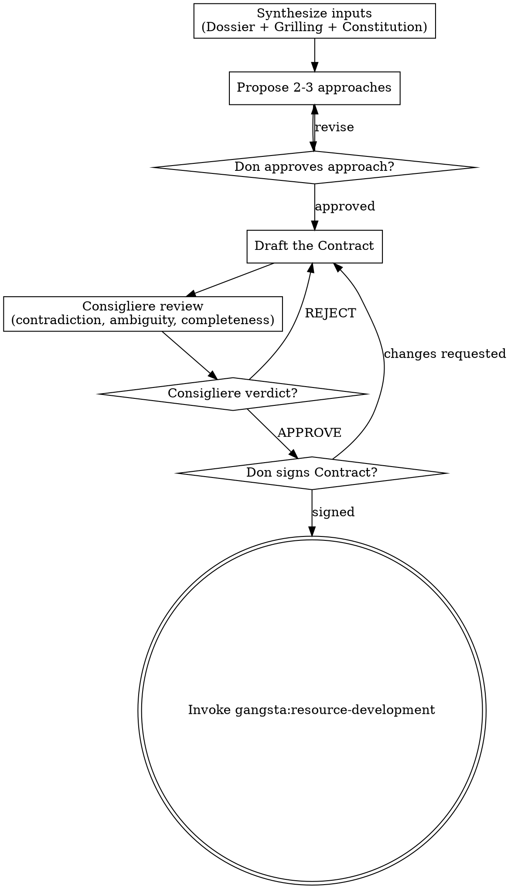

# The Sit-Down: Planning and Spec Drafting

## Overview

The Sit-Down is where the Don, Consigliere, and Underboss finalize the Contract — the binding specification for the Heist. This is a "Plan-First" phase where code generation is STRICTLY PROHIBITED.

## Trigger

Invoked after the Don approves the Grilling consensus (The Grilling complete).

## The Absolute Rule

**NO CODE GENERATION DURING THE SIT-DOWN.**

Not pseudocode. Not "example snippets." Not "draft implementations." NOTHING that looks like code. If you catch yourself writing code, STOP. You are violating Omerta Law 5.

The Contract describes WHAT and WHY. Implementation details (HOW) belong in the Work Packages created during Resource Development.

## Flow



## Process

### Step 1: Synthesize Inputs

Gather and internalize all available intelligence:
- Reconnaissance Dossier
- Grilling Consensus or Best Available Consensus
- Project Constitution (Commandments and Negative Constraints)
- Relevant Ledger Entries

### Step 2: Propose 2-3 Approaches

Before writing any spec, the Underboss must present the Don with **2-3 distinct viable approaches** to the problem. Each approach must cover:

```
### Approach A: <Name>
<One-sentence description>

**Pros:** <key advantages>
**Cons:** <key trade-offs>
**Risk:** HIGH / MEDIUM / LOW
**Best when:** <conditions that favour this approach>
```

Rules:
- Approaches must be genuinely distinct — not minor variations of the same idea
- At least one conservative/safe option and one bolder option
- No code. No pseudocode. Architecture and rationale only.

Present all approaches then ask: **"Which approach do you want to proceed with, or would you like adjustments?"**

**Wait for the Don's explicit selection before writing anything.**

- Don selects / approves → proceed to Step 3
- Don requests revision → update proposals, re-present

### Step 3: Underboss Drafts the Contract

Using the approved approach as the architectural foundation, draft the formal specification.

**The Contract must include:**

```markdown
---
heist: <heist-name>
date: YYYY-MM-DD
status: draft
signatories: []
---

# Contract: <Heist Name>

## Objective
<What is being built, in one paragraph>

## Requirements
### Functional Requirements
1. <FR-001> <Requirement>
2. <FR-002> <Requirement>
...

### Non-Functional Requirements
1. <NFR-001> <Requirement (performance, security, accessibility, etc.)>
...

## Architectural Decisions
<Key decisions from the Grilling consensus, with rationale>

## Grilling Conclusions
### Key Decisions
- <Decision>: <rationale>

### Rejected Alternatives
- <Alternative>: <why rejected>

### Unresolved Objections
- <Objection> — Risk: HIGH/MEDIUM/LOW — Mitigation: <if any>

## Applicable Constitution Rules
### Commandments
- <Commandment text> — Source: insights/<file>

### Negative Constraints
- NEVER <constraint> — Source: fails/<file>

## Acceptance Criteria
<How do we know the Heist is complete? Specific, testable criteria.>

## Out of Scope
<What this Heist explicitly does NOT cover>

## Open Risks
<From the Grilling — any unresolved objections with assessed risk>
```

### Step 4: Consigliere Reviews

Invoke `gangsta:the-consigliere` for spec integrity review:
- Contradiction scan
- Ambiguity check
- Completeness audit
- Constitution alignment
- Security review

The Consigliere returns a verdict: APPROVE, APPROVE WITH CONCERNS, or REJECT.

If REJECTED: Underboss revises based on Consigliere feedback. Re-review.

### Step 5: Don Signs the Contract

Present the Contract to the Don:
> "The Contract for Heist '<name>' is ready for your review. The Consigliere's verdict: [verdict]. [If concerns, list them.] Do you approve?"

The Don may:
- **Sign** — Contract is binding. **Immediately invoke `gangsta:resource-development` — do NOT ask the Don what to do next, do NOT pause, do NOT prompt for confirmation. Auto-advance is mandatory.**
- **Request changes** — Underboss revises. Back to Step 4 (Consigliere re-reviews).
- **Kill the Heist** — Abort. No further phases.

Update the Contract frontmatter:
```yaml
status: signed
signatories: [Don, Consigliere, Underboss]
```

## Output

Save to: `docs/gangsta/<heist-name>/specs/YYYY-MM-DD-contract.md`

## Checkpoint

```yaml
---
heist: <heist-name>
phase: the-sit-down
status: completed
timestamp: <ISO 8601>
next-action: Proceed to Resource Development
artifacts:
  - docs/gangsta/<heist-name>/specs/YYYY-MM-DD-contract.md
---
```

## Omerta Compliance
- [ ] Spec is Law: The Contract becomes the binding spec — all future phases must trace to it
- [ ] Rule of Truth: All requirements cite Dossier findings or Grilling consensus
- [ ] Rule of Availability: Contract and checkpoint saved to files
- [ ] NO CODE: Verify zero code blocks in the Contract
